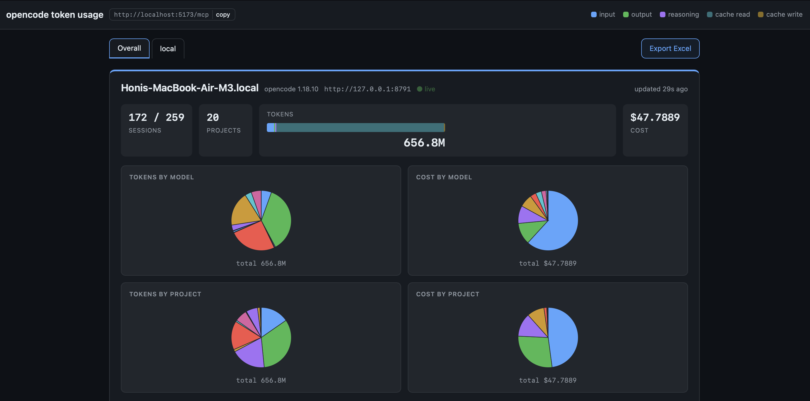
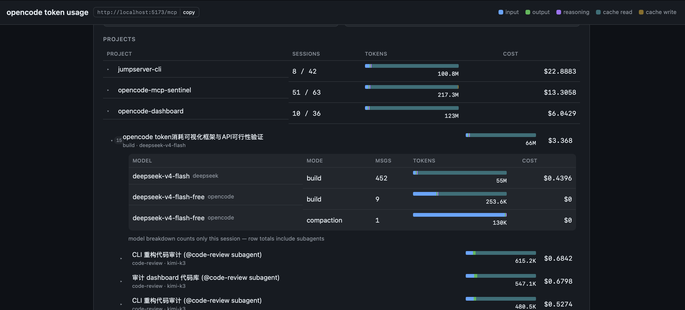
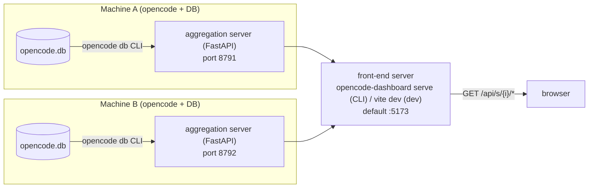

# opencode-dashboard

[](https://www.npmjs.com/package/opencode-dashboard-client)[](https://www.npmjs.com/package/opencode-dashboard-client)
[](https://pypi.org/project/opencode-dashboard-server/)[](https://pypi.org/project/opencode-dashboard-server/)
[](https://github.com/GCS-ZHN/opencode-dashboard/actions/workflows/ci.yml)

A dashboard that visualizes opencode token usage — drill down from **server → project → session → model** and see input / output / reasoning / cache tokens and cost for each level.

## Overview

opencode stores every session and message (with per-message token counts and cost) in a local SQLite database. This project turns that data into a live, hierarchical dashboard:

- **Per-host aggregation backend** — a small FastAPI server that reads opencode's storage via the `opencode db` CLI and exposes a JSON + SSE API.
- **Single front-end entry point** — the browser only talks to one front-end server, which proxies to any number of aggregation backends. Each backend gets its own tab; an **Overall** tab shows a two-column grid of all of them.

It targets users who run opencode on several machines and want one page to watch all of them.

## Architecture





Notes:

- Each aggregation server shells out to `opencode db "<SQL>"` on its own host — it never opens the SQLite file directly (the DB is WAL-mode and can be 300MB+; see *Development intent*).
- The front-end server is the **only** endpoint the browser reaches. In dev, Vite's dev server generates the same proxy from the repo's `dashboard.yaml`; in production, `opencode-dashboard serve` serves `dist/` and proxies `/api/s/{i}/*` → the configured servers (XDG config, written by `opencode-dashboard configure`). The route scheme is identical in both, so switching is transparent. Real backends may be unreachable from the client's network — this indirection is deliberate. The SPA fetches the resolved server list + UI options from `GET /api/config` at startup, so changing config is all a deployer touches.
- Live updates flow back over **SSE** (`/api/s/{i}/stream`), so the page refreshes itself as opencode writes new sessions.

## Features

- **Multi-backend aggregation** — one aggregation server per opencode host; the front-end proxies all of them and shows each in its own tab.
- **Two-level drill-down** — `/projects/{id}` lists a project's sessions, `/sessions/{id}` gives the per-model breakdown (input/output/reasoning/cache + cost) for a session, including mid-conversation model switches.
- **Session tree** — sessions are rendered as parent/child trees (subagent & fork sessions attach to their parent). Subagents are **collapsed by default**; a parent's totals **include all descendants**.
- **Main vs. total sessions** — every level distinguishes *main* sessions (tree roots) from *total* (including subagents).
- **SSE live refresh** — the server polls the DB (~5s) and broadcasts `updated` events; the client refetches only what changed.
- **Multi-server tab view** — an Overall tab with a two-column grid plus one tab per configured backend.
- **Aggregation pies** — four interactive donut charts per server (tokens/cost × model/project); hover a slice to see its value and share.
- **Excel export** — one click downloads the current view as `.xlsx` (single-server tab → one workbook; Overall tab → one sheet per server), generated entirely in the browser.
- **MCP server** — the front-end server also speaks Model Context Protocol at `/mcp` (copy the endpoint URL from the header), exposing the same overview/project/session queries as read-only tools for agent clients.

## MCP tools

The front-end server exposes a read-only **MCP server** at `/mcp` (and `/mcp/`) on the same process as the dashboard. Point an MCP client (e.g. opencode) at it — `opencode mcp add opencode-dashboard --url http://<host>:<port>/mcp` — and the following tools become available. Every tool takes a `server` index (0-based position in the front-end's configured backend list; use `list_servers` to see them) and returns the same JSON the HTTP API serves.

| Tool | Inputs | Returns |
|------|--------|---------|
| `list_servers` | — | Configured backend name + URL list |
| `overview` | `server` | Host-wide aggregate: project/session counts, tokens, cost |
| `projects` | `server` | Per-project rollups (tokens + cost) |
| `project_detail` | `server`, `projectId` | One project plus its sessions |
| `session_detail` | `server`, `sessionId` | One session plus its per-model token/cost breakdown |

MCP clients go through the front-end server exactly like the browser does — they never talk to real backends directly. The tools are read-only.

## Install

Prerequisites:

- **Python ≥ 3.10** and [uv](https://github.com/astral-sh/uv)
- **Node ≥ 22** and [bun](https://bun.sh)

Server (`server/`):

```bash
cd server
uv sync            # install deps (fastapi, uvicorn + dev: pytest, httpx)
uv run pytest      # run the test suite
```

Client (`client/`):

```bash
cd client
bun install
bun run build      # typecheck (tsc) + bundle (vite)
```

### Install from registries (published packages, CLI)

Both packages install as **CLIs** — configure them interactively, no editing package files.

- **Front end** — `npm install -g opencode-dashboard-client` (or `npx opencode-dashboard ...`):
  ```bash
  opencode-dashboard configure   # interactive: add backends, port, host, ui → XDG config
  opencode-dashboard serve       # start the front-end server (default http://localhost:5173/)
  ```
- **Backend** — `uv tool install opencode-dashboard-server`, then on each opencode host:
  ```bash
  opencode-dashboard-server configure   # interactive: port, host, CORS, poll → XDG config
  opencode-dashboard-server serve       # start the aggregator (default port 8791)
  ```

Runtime configuration lives in the **XDG config dir** (`~/.config/opencode-dashboard/`, front end
`config.yaml` / back end `server.yaml`, shared directory, separate files), written by the
`configure` command — never by editing files inside an installed package.

## Usage

### 1. Configure and run the backends

On each opencode host:

```bash
opencode-dashboard-server configure   # defaults are fine for a first run
opencode-dashboard-server serve
```

`serve` accepts `--port N` / `--host H` / `--config PATH` overrides. Run more hosts with different
ports (`8792`, `8793`, …) and list each of them in the front end's config next.

### 2. Configure and run the front end

```bash
opencode-dashboard configure   # add every backend: name + url; set port/host/sessionPage
opencode-dashboard serve
```

The SPA fetches the server list + UI options from `GET /api/config` at startup — it never bundles
them, so changing config and restarting `serve` is all it takes.

## Development (from source)

```bash
# server
cd server && uv sync && uv run pytest && uvx ruff check .
# client
cd client && bun install && bun run dev   # Vite dev server reads the repo dashboard.yaml → :5173
bun run build                              # typecheck (tsc) + bundle (vite) + CLI bundle
```

Dev uses the repo's `client/dashboard.yaml`; the published npm package never ships it — the installed
CLI reads the XDG file written by `configure`. `bun mock-server.ts` serves canned `API.md` JSON for
frontend-only work.

## Development intent

Two deliberate design decisions:

1. **Single front-end entry point (proxy).** The browser never talks to the real aggregation backends — they may be unreachable from the client's network. Instead the front-end server (Vite in dev, `opencode-dashboard serve` in prod) proxies `/api/s/{i}/*` → the configured servers (XDG config), so one page can show backends spread across machines. Client code uses relative `/api/s/{i}` paths only — no backend URLs reach the browser.

2. **Data source via the `opencode db` CLI, never direct file access.** opencode's SQLite store is WAL-mode, grows past 300MB, and is actively written while opencode runs. Opening it directly risks lock contention and torn reads. Every aggregation query goes through `opencode db "<SQL>" --format json|tsv` (schema and gotchas are documented in `AGENTS.md`); re-verify the schema before touching aggregation logic, since opencode table columns change between versions.

## API contract

The server↔client contract lives in [`API.md`](API.md) and both sides implement exactly that: endpoint list, JSON shapes (camelCase, epoch-ms timestamps), ordering rules, and the SSE event format. If you change it, change `API.md` first, then both sides.

Endpoints: `GET /health`, `GET /overview`, `GET /models`, `GET /projects`, `GET /projects/{projectId}`, `GET /sessions/{sessionId}`, `GET /stream` (SSE).

## TODO (roadmap)

- [x] **Show version in the UI** — the front-end version shows in the header; each backend tab shows its `opencode-dashboard-server` version next to the opencode version.
- [ ] **Loading animations** — replace the current "stuck" feel when content loads (initial page load, expanding/collapsing sessions, switching tabs) with a proper loading animation.
- [ ] **HTTP Basic Auth** — standard HTTP basic auth on the front-end server (works with any browser, no extra front-end code).
- [ ] **Incremental sync / caching** — poll once and serve from cache instead of re-aggregating on every request.
- [ ] **Time-range filtering** — restrict the drill-down to a date window (e.g. today / last 7 days / custom).

## License

MIT — see [LICENSE.md](LICENSE.md).
